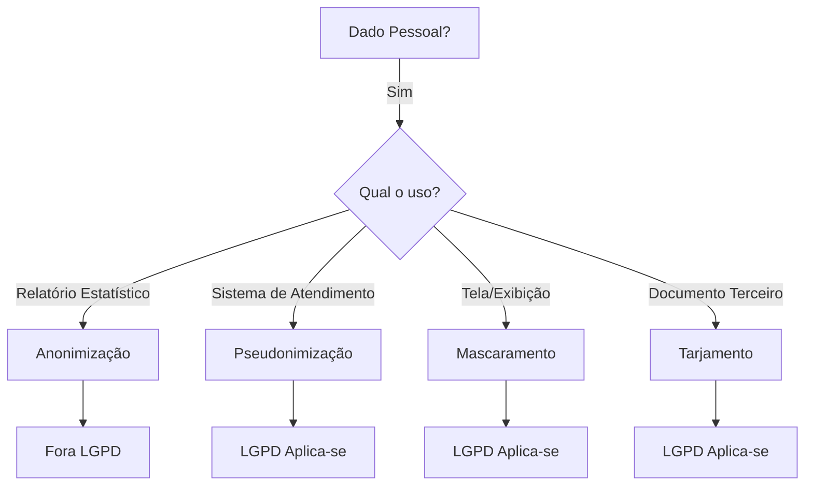

# Técnicas de Proteção de Dados — LGPD

Síntese das principais técnicas para proteção de dados pessoais no Brasil, com definição legal, implicações jurídicas e uso prático no TRE-PR.

## Definições Legais (LGPD)

| Termo | Definição (Art. 5º) | Natureza Jurídica |
|-------|---------------------|-------------------|
| **Anonimização** | "utilização de meios técnicos razoáveis e disponíveis no momento do tratamento, por meio dos quais um dado perde a possibilidade de associação, direta ou indireta, a um indivíduo" | **Não é dado pessoal** (fora do escopo da LGPD) |
| **Pseudonimização** | Dado pessoal que pode ser reidentificado com informações adicionais mantidas separadamente (chave de pseudonimização) | **É dado pessoal** (sujeito à LGPD) |

---

## Comparativo de Técnicas

| Técnica | Como funciona | Reversível? | Status LGPD | Exemplo Prático |
|---------|---------------|-------------|-------------|-----------------|
| **Anonimização** | Agregação total ou transformação irreversível (ex: hash com salt forte, k-anonimidade) | ❌ Não (com meios razoáveis) | **Não é pessoal** | "1.000 passageiros no Bairro X às 8h" (sem identificação individual) |
| **Pseudonimização** | Substituição do identificador por código + chave guardada à parte | ✅ Sim (com a chave) | **É pessoal** | Paciente #A8493 (nome substituído por código; chave guardada à parte) |
| **Mascaramento** | Substituição parcial de caracteres para exibição | ⚠️ Depende da implementação (visualização) | **É pessoal** (medida de segurança) | CPF: `123.***.***-00` (parcial) |
| **Tarjamento** | Ocultação completa em documento físico/PDF | ❌ Não (visual) | **É pessoal** (redução de exposição) | Tarja preta sobre o nome em documento impresso |

---

## Uso Prático no TRE-PR

### 📱 Exibição em Telas (Frontend)
| Dado | Técnica | Justificativa |
|------|---------|---------------|
| CPF | Mascaramento parcial (`***`) | Evita visualização completa por quem não precisa ver |
| Nome | Mascaramento parcial (`M. da Silva`) | Reduz exposição sem perder contexto |
| Data de Nascimento | Ocultar dia/ano (`**/**/1980`) | Limita risco de reidentificação |

### 📄 Documentos e Relatórios
| Situação | Técnica | Regra |
|----------|---------|-------|
| **Interno (servidores autorizados)** | Pseudonimização | Mantém vínculo funcional (ex: para recurso) |
| **Para Terceiros (Poder Público, Parceiros)** | Tarjamento completo | Remove exposição desnecessária |
| **Relatórios Estatísticos** | Anonimização | Dados agregados sem risco de reidentificação |

---

## ⚠️ Ponto Crítico: Mascaramento ≠ Anonimização

> **Importante:** O mascaramento parcial (ex: `123.***.***-00`) **NÃO** configura anonimização sob a LGPD.

| Por que? | Explicação |
|----------|------------|
| **Reversibilidade** | O CPF real ainda existe no banco de dados |
| **Risco** | Se o sistema for comprometido, o dado real pode ser exposto |
| **Compliance** | Mantém **todas** as obrigações da LGPD (consentimento, direitos, registro, segurança) |
| **O que é?** | É uma **medida de segurança** (art. 46), não anonimização |

---

## Fluxo de Decisão

## Referências

- LGPD Art. 5º, incisos III e XI (definições)
- LGPD Art. 12 (pseudonimização)
- Guia da ANPD sobre Anonimização (minuta em análise)
- IN TRE-PR 004/2025 (Gestão de Identidade e Controle de Acesso)

## Relacionamentos

- [[concepts/anonimizacao-pseudonimizacao-lgpd]] — Síntese técnica sobre anonimização
- [[concepts/lgpd-fundamentos]] — Fundamentos da LGPD
- [[normas/tre-pr-in-004-2025-gestao-identidade]] — Controle de acesso
- [[entities/cgsipdp]] — Comitê Gestor de SI e PDP
